<h1 align="center">📦 Sistema de Abastecimiento Inteligente (SAI)</h1>

<p align="center">
  <strong>Orquestador multi-local para la automatización logística y financiera.</strong><br>
  Construido con Python, SQLAlchemy y Google Sheets API.
</p>

<p align="center">
  
  
  
  
  
</p>

---

## 📖 Descripción del Proyecto

> [!NOTE]
> **Estado del proyecto.** Diseñado y prototipado para un entorno multi-local real: relevamiento de la operación, modelo de datos y flujo completo funcionando de punta a punta. Fue presentado a dirección financiera y quedó pendiente de implementación. Los datos incluidos en el repositorio son sintéticos (`demo_injector.py`).

El **Sistema de Abastecimiento Inteligente (SAI)** es una solución de backend distribuido diseñada para automatizar la cadena de suministro en múltiples sucursales locales. Combina la accesibilidad y nula curva de aprendizaje de Google Sheets (como frontend) con la robustez transaccional de una base de datos centralizada (SQLite/Cloud SQL) y orquestación en Python.

**SAI resuelve problemas críticos operativos:**
- 🚫 Eliminación de pedidos fuera de horario y errores de tipeo manuales.
- 📉 Visibilidad en tiempo real del inventario y las cuentas por pagar (Fill Rate y Total Real).
- 🚚 Trazabilidad completa de recepciones e incidencias (reclamos) con proveedores.
- 📊 Sincronización automática con Data Warehouse para dashboards en Data Studio/Looker.

## 🚀 Arquitectura

El ecosistema está dividido en 4 capas fundamentales:

1. **Master (Control Central):** Un Google Sheet donde Finanzas/Compras definen los SKUs, los proveedores, precios y horarios de corte (Deadlines).
2. **Locales (Frontend Operativo):** Cada sucursal tiene su propia plantilla sincronizada. Cuenta con pestañas blindadas y protegidas para realizar `PEDIDOS`, auditar `STOCK`, realizar `RECEPCION` y gestionar `RECLAMOS`.
3. **Orquestador (El Motor):** Scripts en Python (`main.py`) que leen los datos de todos los locales en paralelo, calculan reglas de negocio, y registran estados en una base de datos relacional. Genera órdenes de compra consolidadas por proveedor.
4. **Data Warehouse (Analítica):** Exportación continua de la "verdad financiera" (`Total_Real`, `Fill Rate`, métricas de proveedores) para visualización ejecutiva.

```mermaid
flowchart LR
    subgraph C1["1 · Master"]
        M["Google Sheet maestro<br/>MASTER_SKU · MASTER_PROV<br/>precios y horarios de corte"]
    end

    subgraph C2["2 · Locales"]
        L["Un Sheet por sucursal<br/>PEDIDOS · STOCK<br/>RECEPCION · RECLAMOS"]
    end

    subgraph C3["3 · Orquestador"]
        direction LR
        O["main.py"] --> D{"¿Antes del<br/>horario de corte?"}
        D -->|sí| B[("order_buffer<br/>consolida por<br/>SKU + centro de costo")]
        D -->|no| T["LATE"]
        T -.->|próximo ciclo| B
        B --> E["mailer.py<br/>OC consolidada<br/>por proveedor"]
        E -->|entrega| R["Recepción<br/>y reclamos"]
        R --> H[("order_history<br/>SENT · COMPLETE<br/>PARTIAL · CANCELLED")]
    end

    subgraph C4["4 · Analítica"]
        W["warehouse_sync.py<br/>Total_Real · Fill Rate"]
    end

    M -->|catálogo y reglas| L --> O
    H --> W

    style T fill:#78350f,stroke:#f59e0b,color:#fff
    style D fill:#1e3a5f,stroke:#3b82f6,color:#fff
    style R fill:#064e3b,stroke:#10b981,color:#fff
```



Dos nodos concentran la lógica de negocio que justifica el sistema:

- **El rombo del horario de corte.** Cada proveedor tiene su propia `hora_limite`.
  Un pedido cargado después pasa a `LATE` en lugar de perderse o de colarse en una
  orden ya cerrada: entra al ciclo siguiente. El modo `--manual` saltea este corte
  para demostraciones.
- **«Recepción y reclamos» (en verde).** Un faltante o un producto dañado impacta
  la métrica financiera del proveedor **sin** alterar el inventario, que solo
  registra lo que efectivamente llegó. Separar esas dos cosas es lo que evita que
  un reclamo infle el stock teórico, y es la regla más fácil de romper en un
  refactor.

## ✨ Características Principales

- **Validaciones Inteligentes:** "Semáforos" visuales en celdas, protección contra escritura de columnas clave y dropdowns auto-completados.
- **Gestión Avanzada de Reclamos:** Flujo de auditoría automatizado para gestionar *Faltantes* y *Productos Dañados*, impactando directamente en la métrica financiera del proveedor sin alterar falsamente el inventario.
- **Notificaciones Automatizadas:** Integración de envío de correos (`mailer.py`) con adjuntos PDF/CSV para despachar las órdenes consolidadas a los proveedores.
- **Auditoría Global (`audit_job.py`):** Exportación programada de reportes ejecutivos.
- **Modo Demo (`--manual`):** Capacidad para ejecutar simulaciones ignorando restricciones horarias, ideal para pruebas de estrés y presentaciones directivas.

## 🛠️ Stack Tecnológico

- **Lenguaje:** Python 3.9+
- **Database:** SQLAlchemy (SQLite default, fácilmente escalable a PostgreSQL/Cloud SQL)
- **Integraciones:** `gspread`, `oauth2client` (Google Drive & Sheets API)
- **Gestión de Entorno:** `python-dotenv`

## ⚙️ Instalación y Configuración

### 1. Clonar el Repositorio
```bash
git clone https://github.com/SimonChiabo/Sistema-de-Abastecimiento-Inteligente.git
cd Sistema-de-Abastecimiento-Inteligente
```

### 2. Entorno Virtual y Dependencias
```bash
python -m venv venv
source venv/bin/activate  # En Windows: venv\Scripts\activate
pip install -r requirements.txt
```

### 3. Variables de Entorno (`.env`)
Copiá `.env.example` a `.env` y completá los valores:
```bash
cp .env.example .env
```
```env
# Google Sheets API
CREDENTIALS_PATH=credentials.json
MASTER_SPREADSHEET_NAME=SAI - Sistema de Abastecimiento
LOCAL_PREFIX=SAI_Local_

# Base de datos
DB_URL=sqlite:///sai_local.db

# Notificaciones (contraseña de aplicación, no la de la cuenta)
SMTP_SERVER=smtp.gmail.com
SMTP_PORT=587
SMTP_USER=tu-cuenta@ejemplo.com
SMTP_PASS=
ADMIN_EMAIL=tu-cuenta@ejemplo.com

# Sincronización con depósito central (opcional)
WAREHOUSE_SYNC_ENABLED=false
WAREHOUSE_SPREADSHEET_ID=
```
*(Colocá tu `credentials.json` —cuenta de servicio generada en Google Cloud Console, con Sheets API y Drive API habilitadas— en el directorio raíz. Está en `.gitignore`.)*

## 🏃‍♂️ Uso Operativo

### Inicializar Plantillas Locales
Para crear y formatear (colores, validaciones, bloqueos) una plantilla local:
```bash
python setup_local.py "SAI_Local_01"
```

### Ejecutar el Orquestador
Para iniciar el ciclo de conciliación de pedidos y actualización de base de datos (generalmente configurado en un CRON Job):
```bash
python main.py
```
> Añade el flag `--manual` para ignorar los horarios de corte durante demostraciones.

### Inyectar Datos de Prueba
Para llenar la base de datos y limpiar historiales en ambientes de desarrollo:
```bash
python demo_injector.py
```

## 🔮 Proyección de pedidos y backtesting

```bash
python forecast_report.py
```

El orquestador automatiza la captura de pedidos, pero no decide **cuánto** pedir:
eso lo sigue poniendo a mano el encargado de cada local. `core/forecast.py` es el
modelo que responde esa pregunta.

| Paso | Qué hace |
|---|---|
| Consumo base | Promedio móvil de los últimos N días. El consumo de hace seis meses no informa sobre el de esta semana. |
| Estacionalidad | Factor por día de semana. Un pedido del jueves que llega el domingo atraviesa el fin de semana, que es cuando más se consume. |
| Stock de seguridad | `z · desvío · √lead_time`. Con la raíz y no con el lead time entero: los desvíos diarios se compensan parcialmente. |
| Punto de reorden | Consumo esperado durante el lead time + stock de seguridad. |
| Sugerencia | `punto_de_reorden − stock_actual − pendiente_de_recepción`. Restar lo pendiente evita el error clásico: volver a pedir lo que ya viene en camino. |

### El backtest

Un modelo sin evaluación es una idea. `core/backtest.py` reproduce una serie de
consumo día por día y mide qué habría pasado, comparando **tres** políticas sobre
exactamente el mismo consumo.

La tercera existe para no atribuirle a la estacionalidad un mérito que es del
colchón: comparar "promedio sin colchón" contra "estacional con colchón" mezcla
los dos efectos.

Resultado sobre una serie sintética de 180 días (`SEMILLA=42`, consumo base 20/día,
ruido gaussiano 25%, lead time 3 días):

| Política | Quiebres | Servicio | Stock prom. |
|---|---|---|---|
| **Serie con estacionalidad semanal** | | | |
| Promedio plano | 42 | 72,4% | 9,5 |
| Promedio + stock de seguridad | 11 | 92,8% | 26,9 |
| Estacional + stock de seguridad | **8** | **94,7%** | **26,4** |
| **Serie plana (control)** | | | |
| Promedio + stock de seguridad | **7** | **95,4%** | **13,4** |
| Estacional + stock de seguridad | 11 | 92,8% | 13,6 |

Lo que dice el backtest, sin adornos:

- **El grueso de la mejora es el stock de seguridad**, no la estacionalidad: 31 de
  los 34 días de quiebre evitados. Y se paga con inventario, de 9,5 a 26,9 unidades
  promedio.
- **Modelar el día de semana aporta poco pero aporta**: 3 quiebres menos con
  levemente *menos* stock. Ganar en las dos dimensiones a la vez es lo que lo hace
  una mejora real y no un intercambio.
- **Cuando la estacionalidad no existe, el modelo pierde**: en la serie plana
  provoca 4 quiebres más que el promedio simple, porque ajusta ruido como si fuera
  estructura.

La serie de control está justamente para eso. Generar consumo con estacionalidad y
después mostrar que la política que modela estacionalidad gana no probaría nada:
la respuesta estaría construida dentro del dato.

> [!NOTE]
> **Datos sintéticos.** La serie se genera con los parámetros que el propio reporte
> imprime. Esto demuestra el **método de evaluación**, no un resultado obtenido en
> producción.
>
> **Dos puntos de integración pendientes.** `MASTER_PROV` no guarda un lead time
> real: el modelo lo recibe como parámetro y puede derivar un piso desde
> `dias_programados` (días hasta la próxima entrega programada). Y el stock actual
> vive en la pestaña `STOCK` de cada local, que hoy `setup_local.py` crea pero
> ningún módulo lee. Por eso `stock_actual` y `pendiente_recepcion` entran como
> argumentos: el modelo está listo, la ingesta es el paso siguiente.

## 🧪 Tests

```bash
pip install -r requirements-dev.txt
python -m pytest
```

41 tests: reglas de negocio, modelo de proyección y motor de backtesting. No buscan cobertura alta: buscan **dejar
escrita la regla**, porque son las decisiones que un refactor puede romper en
silencio sin que falle nada visible.

| Regla | Qué se verifica |
|---|---|
| Corte por horario | Un pedido posterior al corte del proveedor queda `LATE` y entra al ciclo siguiente. A la hora exacta todavía entra. `--manual` saltea el corte. |
| Consolidación | Dos cargas del mismo SKU en el mismo local son una sola línea; distinto centro de costo **no** consolida; sobre un pedido ya `SENT` tampoco. |
| Cancelación | Borra `PENDING` y `LATE`, nunca lo ya despachado. |
| Verdad financiera | Un faltante baja `total_real` (lo que se le paga al proveedor) **sin** reescribir la cantidad pedida. |
| Reclamos | Resuelto entregado restituye el fill rate a 100%; cancelado sin stock deja el faltante registrado en la métrica del proveedor. |

La suite corre contra una base SQLite temporal: `tests/conftest.py` reapunta el
engine explícitamente, así que nunca toca `sai_local.db`.

Las reglas puras viven en [`core/rules.py`](core/rules.py), separadas del
orquestador para que se puedan testear sin red ni base de datos.

## 📂 Estructura del Proyecto

```text
├── core/
│   ├── auth.py             # Autenticación con Google APIs
│   ├── db_handler.py       # Modelos ORM y lógica de Base de Datos
│   ├── log_config.py       # Sistema de logs estandarizado
│   ├── reception.py        # Procesamiento de feedback y reclamos multi-local
│   ├── rules.py            # Reglas de negocio puras (corte horario, fill rate)
│   ├── forecast.py         # Modelo de proyección de pedidos (puro)
│   ├── politicas.py        # Políticas de reposición comparables
│   └── backtest.py         # Motor de simulación día por día
├── forecast_report.py      # Backtest comparativo sobre datos sintéticos
├── tests/                  # Suite de reglas de negocio (pytest)
├── logs/                   # Registro diario (.log, no versionado)
├── main.py                 # Orquestador principal (Entrypoint)
├── setup_local.py          # Configuración y formateo de templates
├── warehouse_sync.py       # Sincronización con Data Studio / Looker
├── mailer.py               # Generación y envío de Órdenes de Compra
├── audit_job.py            # Reportería ejecutiva
├── demo_injector.py        # Inyector de datos sintéticos (White-label)
└── .env.example            # Plantilla de variables de entorno
```

## 🛡️ Licencia

Distribuido bajo licencia MIT. Ver [`LICENSE`](LICENSE) para el texto completo.
