# Sistema de Abastecimiento Inteligente (SAI)

Un orquestador de pedidos multi-local que usa Google Sheets como interfaz para
los locales y una base de datos central como única fuente de verdad sobre qué se
pidió, qué llegó y qué se le debe a cada proveedor.

<p>
  
  
  
  
</p>

---

## Estado del proyecto

**Diseñado a partir de un problema operativo real, demostrado a la dirección
financiera de la empresa donde se originó y con visto bueno para avanzar. No está
implementado ni ha corrido nunca en producción.**

El diseño nació por iniciativa propia dentro de un grupo gastronómico multi-local
de Andorra, a partir del circuito de pedidos que se usaba ahí. La secuencia fue
esta:

1. Se envió por correo la propuesta a la dirección financiera y de operaciones,
   mencionando que existía una versión funcional corriendo en local.
2. El director financiero pidió verla. El de operaciones no pudo asistir.
3. Se preparó y realizó una demo en vivo del sistema funcionando.
4. Dio el visto bueno para avanzar. Abril de 2026.
5. La implementación quedó pendiente por causas ajenas al proyecto.

Este repositorio es una versión desvinculada de esa empresa. Los SKUs, los
nombres de locales y los proveedores son genéricos; los datos de demostración se
generan con `demo_injector.py` y `forecast_report.py`. No contiene credenciales,
configuraciones ni información operativa de ninguna organización.

Todo lo que sigue describe el comportamiento del software y las decisiones de
diseño, no una operación en curso.

---

## El problema

En un grupo con varios locales, el abastecimiento se coordina por WhatsApp,
llamada y planilla suelta. Cada local pide por su cuenta a cada proveedor. Ese
circuito falla en cuatro puntos, y los cuatro cuestan dinero:

**Los pedidos llegan fuera de horario.** Cada proveedor tiene una hora de corte.
Un pedido cargado después no se rechaza de forma visible: se pierde, o peor, se
cuela en una orden que ya estaba cerrada. El local descubre el faltante cuando
abre la cocina.

**Se pide mal por errores de tipeo.** Sin catálogo único, cada local escribe el
nombre del producto como puede. Dos locales piden el mismo artículo con dos
nombres distintos, el proveedor interpreta, y la diferencia aparece en la
factura.

**Nadie ve el inventario ni lo comprometido.** Sin registro central, no hay forma
de saber cuánto se pidió en total esta semana, cuánto de eso ya llegó, ni cuánto
se le debe a cada proveedor antes de que llegue la factura. El control de gasto
es posterior al gasto.

**Los reclamos no dejan rastro.** Un faltante o un producto dañado se reclama por
teléfono y se resuelve —o no— sin quedar registrado en ningún lado. A fin de mes
no hay manera de responder qué proveedor incumple sistemáticamente, porque el
incumplimiento nunca se escribió.

El costo de todo esto no es una línea en el balance: es compra de urgencia a
precio de urgencia, sobrestock de lo que se pidió dos veces, y facturas que se
pagan completas por mercadería que llegó incompleta.

---

## La decisión de diseño central: Google Sheets como frontend

La decisión de producto más importante del proyecto es la que menos código
tiene: **los locales no usan una aplicación propia, usan una hoja de cálculo.**

Quien carga los pedidos es personal de cocina y encargados de local. No tienen
tiempo ni incentivo para aprender una herramienta nueva, y ninguna curva de
aprendizaje sobrevive a un servicio con la cocina llena. Una aplicación propia
—más elegante, más controlable, más agradable de construir— habría tenido mejor
arquitectura y peor adopción. Y un sistema de abastecimiento que la mitad de los
locales no usa es peor que no tener sistema, porque genera una verdad parcial que
parece completa.

Google Sheets ya está instalado, ya se sabe usar y funciona desde el móvil de
cualquiera. Lo que hace el sistema es convertir esa hoja en una interfaz acotada:
dropdowns alimentados por el catálogo maestro en lugar de texto libre, checkboxes
en vez de estados escritos a mano, una pestaña interna oculta con los datos, y
fondos de color que marcan qué columnas son de solo lectura.

La contrapartida es real y conviene decirla: la validación es blanda. El único
rango protegido —la columna de SKU_ID, que se autocalcula— está en modo aviso,
no bloqueo. Un usuario decidido puede romper una fórmula. La respuesta a eso no
es endurecer el Sheet hasta volverlo incómodo, sino que el orquestador no confíe
en él: cada fila se lee dentro de su propio `try`, una celda mal cargada afecta a
ese pedido y no al ciclo, y la verdad vive en la base de datos, no en la hoja.

---

## La segunda decisión: la orden de compra no sale sola

El piloto que se demostró a la dirección financiera enviaba los pedidos
consolidados directamente a los proveedores: el ciclo corría de punta a punta sin
intervención. Al planificar el paso a producción esa capacidad se degradó a
propósito. La orden queda preparada como un correo listo para reenviar, y el
envío al proveedor pasa por una persona del equipo interno que lo revisa antes.

La alternativa era conservar el envío automático, que ya estaba construido y
funcionando. Se descartó por lo que cuesta un error en ese punto exacto: un
pedido mal consolidado que sale solo es gasto comprometido con un tercero, y
revertirlo depende de la buena voluntad del proveedor. El mismo pedido detenido
esperando una revisión es un archivo que se corrige. El corte por horario y las
validaciones del Sheet bajan la probabilidad de ese error; no la eliminan.

El trade-off es explícito y no conviene disimularlo: **se pierde la automatización
completa** —alguien tiene que estar— **y se gana un punto de control sobre el gasto
antes de que quede comprometido con un tercero.** En un circuito cuyo problema
original era la falta de visibilidad sobre lo comprometido, poner el control ahí
es coherente con el resto del diseño.

**Qué hay en este repositorio.** El código publicado corresponde al estado
posterior a esa decisión, y un paso más atrás todavía: `mailer.py` consolida por
proveedor y escribe la orden como archivo HTML en `outbox/`, y no la envía a
nadie. La columna `Email` de `MASTER_PROV` se sincroniza a la base local y ningún
módulo la lee. El único correo que sale de esa ruta es una copia al administrador
bajo `--manual`, para demostraciones. Falta construir el envío interno —el correo
listo para reenviar— y con él lo que ese envío obliga a resolver: confirmación de
entrega, reintentos, y un registro de qué se mandó a quién y cuándo.

---

## Cómo funciona

Cuatro capas. Las dos primeras son hojas de cálculo, las dos últimas son Python.

1. **Master** — Un spreadsheet donde compras y finanzas definen SKUs,
   proveedores, precios de referencia y horarios de corte.
2. **Locales** — Un spreadsheet por local, con las pestañas `PEDIDOS`, `STOCK`,
   `RECEPCION` y `RECLAMOS`. Se descubren por prefijo de nombre.
3. **Orquestador** — `main.py` captura los pedidos y procesa el feedback;
   `mailer.py` consolida por proveedor y genera la orden de compra.
4. **Analítica** — `warehouse_sync.py` y `analytics_export.py` vuelcan el
   historial a un spreadsheet de BI y a CSV.

```mermaid
flowchart LR
    subgraph C1["1 · Master"]
        M["Google Sheet maestro<br/>MASTER_SKU · MASTER_PROV<br/>precios y horarios de corte"]
    end

    subgraph C2["2 · Locales"]
        L["Un Sheet por local<br/>PEDIDOS · STOCK<br/>RECEPCION · RECLAMOS"]
    end

    subgraph C3["3 · Orquestador"]
        direction LR
        O["main.py"] --> D{"¿Antes del<br/>horario de corte?"}
        D -->|sí| B[("order_buffer<br/>consolida por<br/>SKU + centro de costo")]
        D -->|no| T["LATE"]
        T -.->|próximo ciclo| B
        B --> E["mailer.py<br/>OC consolidada HTML<br/>en outbox/"]
        E -.->|revisión humana interna<br/>antes de enviar al proveedor| R["Recepción<br/>y reclamos"]
        R --> H[("order_history<br/>SENT · COMPLETE · CANCELLED<br/>PENDING_RECTIFICATION<br/>COMPLETE_RECTIFIED · PARTIAL_CLOSED")]
    end

    subgraph C4["4 · Analítica"]
        W["warehouse_sync.py<br/>analytics_export.py"]
    end

    M -->|catálogo y reglas| L --> O
    H --> W

    style T fill:#78350f,stroke:#f59e0b,color:#fff
    style D fill:#1e3a5f,stroke:#3b82f6,color:#fff
    style R fill:#064e3b,stroke:#10b981,color:#fff
```



Dos nodos concentran la lógica que justifica el sistema:

**El rombo del horario de corte.** Cada proveedor tiene su propia `Hora_Limite`.
Un pedido cargado después queda en estado `LATE` en lugar de perderse o de
colarse en una orden ya cerrada: entra al ciclo siguiente. El flag `--manual`
saltea el corte para demostraciones. La regla vive en
[`core/rules.py`](core/rules.py), sin red ni base de datos, para que se pueda
testear y para que esté escrita en un solo lugar.

**«Recepción y reclamos» (en verde).** Un faltante o un producto dañado impacta
la métrica financiera del proveedor **sin** alterar el inventario, que solo
registra lo que efectivamente llegó. Separar esas dos cosas es lo que evita que
un reclamo infle el stock teórico, y es la regla más fácil de romper en un
refactor sin que falle nada visible.

La flecha punteada entre la OC y la recepción es la decisión de diseño de la
sección anterior, dibujada: el orquestador consolida la orden y ahí se detiene a
propósito, esperando la revisión interna que autoriza el envío. En este
repositorio ese tramo no está construido —`mailer.py` deja la orden como archivo
HTML en `outbox/` y no envía nada—, así que la línea punteada marca a la vez una
decisión y un pendiente. Ver
[La orden de compra no sale sola](#la-segunda-decisión-la-orden-de-compra-no-sale-sola).

---

## Qué mide

Esta es la parte que conecta el sistema con el análisis. Registrar el circuito no
es el objetivo: el objetivo es que el circuito deje datos con los que se pueda
decidir algo.

| Métrica | Cómo sale | Qué decisión habilita |
|---|---|---|
| **Fill rate** por proveedor y SKU | `Cant_Recibida / Cant_Pedida`. Ambas columnas van al export; [`core/rules.py`](core/rules.py) tiene la implementación de referencia. | Qué proveedor incumple y en qué artículos. Es el insumo de una renegociación o de un cambio de proveedor, y sustituye la discusión anecdótica por una serie. |
| **Total real** vs. **total pedido** | Total pedido = cantidad × precio. Total real = recibido × precio, lo calcula `warehouse_sync.py`. | La brecha entre ambos es lo que se pidió y no llegó pero se puede estar facturando. Es el control de la factura del proveedor contra lo que efectivamente entró. |
| **Incidencias** | `fulfillment_status` + `incident_notes` en el historial: `COMPLETE`, `CANCELLED`, `PENDING_RECTIFICATION`, `COMPLETE_RECTIFIED`, `PARTIAL_CLOSED`. | Trazabilidad del reclamo: qué se reclamó, si se resolvió entregando o se cerró sin stock. Un reclamo cerrado sin stock deja el faltante registrado contra el proveedor en lugar de desaparecer. |
| **Gasto comprometido y pendiente de conciliación** | `audit_job.py` calcula total de órdenes, monto acumulado y cuántas siguen en `SENT` sin recepción confirmada. | Cuánto hay comprometido y sin cerrar en cualquier momento del mes, antes de que llegue la factura. |

El volcado al spreadsheet de BI está detrás de `WAREHOUSE_SYNC_ENABLED` y por
defecto está desactivado; cuando se habilita, cada corrida reescribe la hoja
completa con el historial.

---

## Proyección de pedidos y backtesting

```bash
python forecast_report.py
```

El orquestador automatiza la captura del pedido, pero no decide **cuánto** pedir:
eso lo sigue poniendo a mano el encargado de cada local.
[`core/forecast.py`](core/forecast.py) es el modelo que responde esa pregunta.

| Paso | Qué hace |
|---|---|
| Consumo base | Promedio móvil de los últimos N días. El consumo de hace seis meses no informa sobre el de esta semana. |
| Estacionalidad | Factor por día de semana. Un pedido del jueves que llega el domingo atraviesa el fin de semana, que es cuando más se consume. |
| Stock de seguridad | `z · desvío · √lead_time`. Con la raíz y no con el lead time entero: los desvíos diarios se compensan parcialmente. |
| Punto de reorden | Consumo esperado durante el lead time + stock de seguridad. |
| Sugerencia | `punto_de_reorden − stock_actual − pendiente_de_recepción`. Restar lo pendiente evita el error clásico: volver a pedir lo que ya viene en camino. |

### El backtest

Un modelo sin evaluación es una idea. [`core/backtest.py`](core/backtest.py)
reproduce una serie de consumo día por día y mide qué habría pasado, comparando
**tres** políticas sobre exactamente el mismo consumo.

La tercera existe para no atribuirle a la estacionalidad un mérito que es del
colchón: comparar "promedio sin colchón" contra "estacional con colchón" mezcla
los dos efectos.

Resultado sobre una serie sintética de 180 días (semilla 42, consumo base 20/día,
ruido gaussiano de 25%, lead time 3 días). Los primeros 28 días son de
calentamiento y no se miden: sin eso se compararía una política con historial
contra una sin historial. Quedan **152 días medidos**, y las cuatro columnas se
definen sobre ese período:

- **Quiebres** — días medidos en los que el stock no alcanzó a cubrir el consumo
  del día, aunque el faltante fuera de una unidad.
- **Ud. faltantes** — suma de las unidades de consumo que el stock no llegó a
  cubrir, acumulada sobre los días medidos. La demanda no servida se pierde, no
  se arrastra: `core/backtest.py` descuenta del stock únicamente lo que sí se
  sirvió, y el faltante se registra sin volver a pedirse al día siguiente.
- **Servicio** — `1 − quiebres / 152`, la proporción de días medidos que cerraron
  sin faltante. Se deriva de la primera columna, no de la segunda.
- **Stock prom.** — stock promedio al cierre del día, después de consumir, sobre
  los días medidos.

**Serie con estacionalidad semanal** — el caso que el modelo asume:

| Política | Quiebres | Ud. faltantes | Servicio | Stock prom. |
|---|---|---|---|---|
| Promedio plano | 42 | 468,9 | 72,4% | 9,5 |
| Promedio + stock de seguridad | 11 | 80,4 | 92,8% | 26,9 |
| Estacional + stock de seguridad | **8** | **53,0** | **94,7%** | **26,4** |

**Serie plana, sin estructura por día de semana** — control:

| Política | Quiebres | Ud. faltantes | Servicio | Stock prom. |
|---|---|---|---|---|
| Promedio + stock de seguridad | **7** | **12,4** | **95,4%** | **13,4** |
| Estacional + stock de seguridad | 11 | 26,1 | 92,8% | 13,6 |

Las dos primeras columnas se leen juntas y ninguna alcanza sola. «Quiebres» y
«Servicio» cuentan días y son ciegos al tamaño del faltante: un día al que le
faltó una unidad pesa igual que uno al que le faltaron cincuenta. «Ud. faltantes»
mide el tamaño pero no dice en cuántos días se repartió. Una política solo es
claramente mejor si gana en las dos, y a igual o menor stock.

Lo que dice el backtest, sin adornos:

- **El grueso de la mejora es el stock de seguridad**, no la estacionalidad.
  Evita 31 de los 34 días de quiebre y 388,5 de las 415,9 unidades no servidas:
  cerca del 93% de la mejora, se mire por donde se mire. Y se paga con
  inventario, de 9,5 a 26,9 unidades promedio.
- **Modelar el día de semana aporta poco en días y algo más en unidades.** Los 3
  quiebres que evita son el 27,3% de los que quedaban (11 → 8); las 27,4 unidades
  que recupera son el 34,1% de las que faltaban (80,4 → 53,0). Que el segundo
  porcentaje sea mayor es justamente lo que la columna de días no puede mostrar:
  el faltante promedio de un día malo baja de 7,3 a 6,6 unidades. Y lo consigue
  con levemente *menos* stock, 26,4 contra 26,9, que es lo que lo vuelve una
  mejora y no un intercambio.
- **Cuando la estacionalidad no existe, el modelo pierde, y pierde en las dos
  métricas**: en la serie plana provoca 4 quiebres más que el promedio simple
  (7 → 11) y más que duplica las unidades no servidas (12,4 → 26,1), porque
  ajusta ruido como si fuera estructura.

La serie de control está justamente para eso. Generar consumo con estacionalidad
y después mostrar que la política que modela estacionalidad gana no probaría
nada: la respuesta estaría construida dentro del dato.

> [!NOTE]
> **Datos sintéticos.** La serie se genera con los parámetros que el propio
> reporte imprime. Esto demuestra el **método de evaluación**, no un resultado
> obtenido en producción.
>
> **Dos puntos de integración pendientes.** `MASTER_PROV` no guarda un lead time
> real: el modelo lo recibe como parámetro y puede derivar un piso desde
> `Dias_Programados` (días hasta la próxima entrega programada). Y el stock actual
> vive en la pestaña `STOCK` de cada local, que `setup_local.py` crea pero ningún
> módulo lee. Por eso `stock_actual` y `pendiente_recepcion` entran como
> argumentos: el modelo está listo, la ingesta es el paso siguiente.

---

## Las reglas escritas como tests

```bash
python -m pytest
```

41 tests. No buscan cobertura alta: buscan **dejar escrita la regla**, porque son
las decisiones que un refactor puede romper en silencio sin que falle nada
visible.

| Regla | Qué se verifica |
|---|---|
| Corte por horario | Un pedido posterior al corte del proveedor queda `LATE` y entra al ciclo siguiente. A la hora exacta todavía entra. `--manual` saltea el corte. |
| Consolidación | Dos cargas del mismo SKU en el mismo local son una sola línea; distinto centro de costo **no** consolida; sobre un pedido ya `SENT` tampoco. |
| Cancelación | Borra `PENDING` y `LATE`, nunca lo ya despachado. |
| Verdad financiera | Un faltante baja el total real (lo que se le paga al proveedor) **sin** reescribir la cantidad pedida. |
| Reclamos | Resuelto entregado restituye el fill rate a 100%; cancelado sin stock deja el faltante registrado en la métrica del proveedor. |

Esas son 19 pruebas; las otras 22 cubren el modelo de proyección y el motor de
backtesting.

La suite corre contra una base SQLite temporal: `tests/conftest.py` reapunta el
engine explícitamente, así que nunca toca `sai_local.db`. Las reglas puras viven
en [`core/rules.py`](core/rules.py) y [`core/forecast.py`](core/forecast.py),
separadas del orquestador para que se puedan testear sin red ni base de datos.

---

## Stack técnico

| Capa | Herramienta | Por qué |
|---|---|---|
| Interfaz de usuario | Google Sheets (`gspread`) | Adopción sin curva de aprendizaje. Es la decisión de diseño central, no una comodidad. |
| Orquestación | Python 3.9+ | Reglas de negocio en módulos puros, sin dependencias de red ni de base. |
| Persistencia | SQLAlchemy sobre SQLite | Una única fuente de verdad transaccional. El `DB_URL` es configurable: apuntar a PostgreSQL o Cloud SQL no requiere cambiar código. |
| Generación de OCs | Jinja2 → HTML | Documento por proveedor, versionable y diffeable. |
| Notificación | `smtplib` (SMTP) | Reporte de auditoría con CSV adjunto al administrador. |
| Analítica | CSV + spreadsheet de BI | Consumible desde Looker Studio o Power BI sin acoplar el orquestador a una herramienta de visualización. |
| Tests | pytest | 41 tests sobre reglas de negocio, proyección y backtesting. |

Autenticación centralizada en [`core/auth.py`](core/auth.py), con reintentos y
backoff exponencial ante errores de la API de Google: los límites de cuota son la
falla más previsible de una integración con Sheets, y no deberían tumbar un ciclo
entero.

---

## Uso e instalación

La guía completa —requisitos, variables de entorno, puesta en marcha, ciclo
operativo y estructura de carpetas— está en **[`docs/SETUP.md`](docs/SETUP.md)**.

Lo mínimo para verlo correr sin credenciales de Google, que es lo único
ejecutable de punta a punta en un clon limpio:

```bash
pip install -r requirements.txt -r requirements-dev.txt
python forecast_report.py    # backtest comparativo sobre datos sintéticos
python -m pytest             # 41 tests
```

El ciclo de abastecimiento (`main.py` + `mailer.py`) necesita una cuenta de
servicio de Google Cloud y los spreadsheets creados. `credentials.json`, `.env`,
la base de datos y los archivos generados están en `.gitignore`.

---

## Limitaciones y próximos pasos

Lo que no está resuelto, en orden de qué haría falta primero para llevarlo a
producción. El envío de la orden al proveedor no figura acá: no es una
funcionalidad que falte sino una que se retiró a propósito, y está explicada en
[La orden de compra no sale sola](#la-segunda-decisión-la-orden-de-compra-no-sale-sola).

**El stock físico no entra al sistema.** `setup_local.py` crea la pestaña `STOCK`
y ningún módulo la lee. Sin esa ingesta, el modelo de proyección recibe
`stock_actual` como argumento en lugar de leerlo, y la sugerencia de cuánto pedir
no puede automatizarse. Es el paso que convierte el modelo en una función del
sistema y no en un script aparte.

**No hay lead time medido.** El modelo lo recibe como parámetro o lo deriva de
los días de entrega programados, que es una cota inferior, no una medición. El
historial ya tiene las fechas necesarias para calcular el lead time real por
proveedor a posteriori; falta cerrar ese ciclo y escribirlo en `MASTER_PROV`.

**El backtest corre sobre datos sintéticos.** Demuestra el método de evaluación,
no un resultado. Con historial real, la misma maquinaria mide las mismas
políticas sobre consumo real, y ahí sí el número significa algo. Los parámetros
de estacionalidad tendrían que estimarse por SKU y local, no fijarse.

**Qué haría distinto.** El acoplamiento a Google Sheets como fuente de lectura
está esparcido por varios módulos: `main.py`, `core/reception.py`, `mailer.py` y
los scripts de sincronización abren spreadsheets por su cuenta. Una capa de
repositorio que devuelva estructuras de datos, con Sheets detrás, dejaría el
orquestador testeable de punta a punta sin red y haría que cambiar de frontend
—si algún día la adopción deja de ser el problema— fuera un cambio local.

